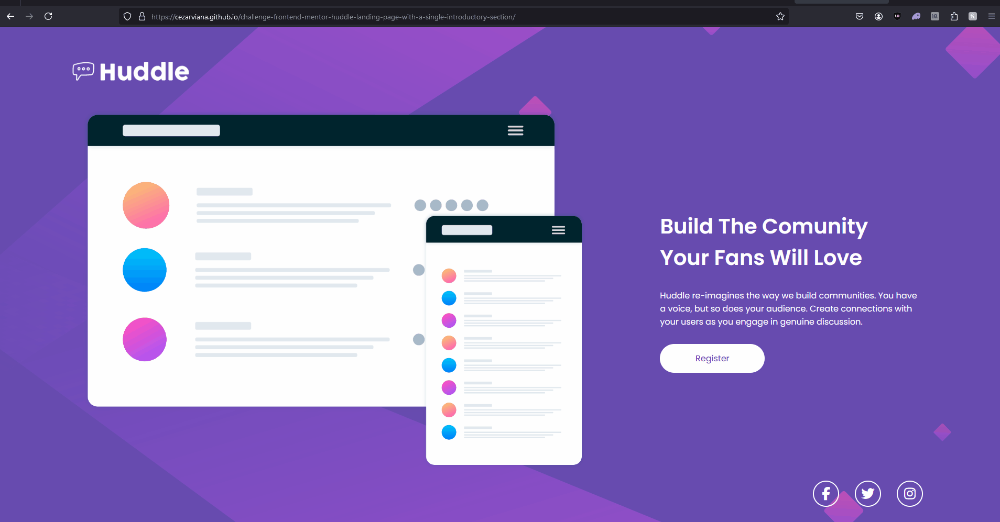
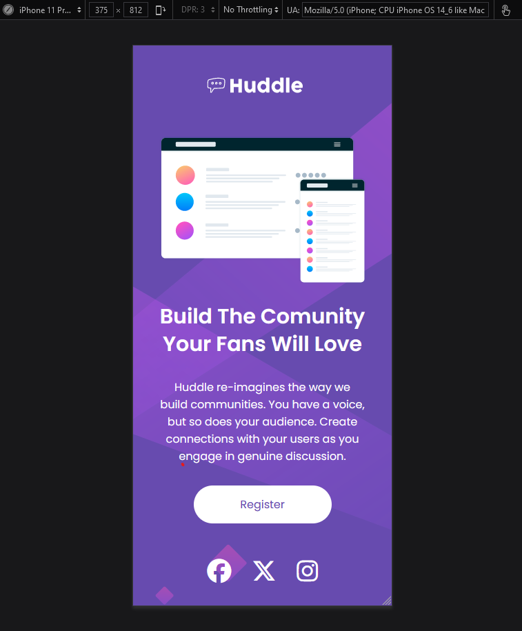

# ⚡ Challenge Frontend Mentor - Huddle landing page with a single introductory section

## 📝 Descrição do Projeto
Criar um layout próximo desse desafio do frontend mentor: [Frontend Mentor | Huddle landing page with a single introductory section](https://cezarviana.github.io/challenge-frontend-mentor-huddle-landing-page-with-a-single-introductory-section/). 
Um projeto para testar o conhecimento de HTML e, principalmente, CSS. Permitindo que seja responsivo, ou seja, funcione tanto para o desktop, telas 4k e mobile.

Acesse o projeto criado aqui: [Huddle landing page](https://cezarviana.github.io/challenge-frontend-mentor-huddle-landing-page-with-a-single-introductory-section/).


## 🔎 Funcionalidades
- Responsivo para todos os dispositivos
- Hovers para os elementos interativos.
- Construção do HTML e CSS


## 🛠️ Ferramentas utilizadas
- **HTML:** Estruturação do projeto
- **CSS:** Estilização do projeto, responsivo
- **Git:** Ferramenta de versionamento


## 🎨 Imagens do projeto

### Imagens do Design a ser seguido
<div align="center">
 <br>

 <br>


</div>


### Imagens do Design criado
<div align="center">


<br>


</div>


## 💡 Decisões do projeto
1. **Fontes**
- [Poppins - Google Fonts](https://fonts.google.com/specimen/Poppins)

2. **Cores**
```
--bg-color: hsl(257, 40%, 49%);
--active-states: hsl(300, 69%, 71%);
--font-color: #fff;
```


## 💦 Dificuldades do projeto
- Tive um pouco de dificuldade com a configuração da resposividade do elemento de fundo.


## 🔓 O que eu aprendi
- Entendi melhor como funciona a responsividade.
- Utilizar o hover para mudar a cor de botões, ao passar o cursor por cima deste.
- Fazer a responsividade para telas +4K.


## 💭 Possíveis atualizações futuras
- Finalizar o README ✅


## 🚀 Como rodar o projeto
Siga os passos abaixo para executar o projeto na sua máquina:

### Pré requisitos

- <strong><i>Git</i></strong>: Para clonar o repositório.


1. Abra o git, e execute os seguintes comandos
2. **Clonar o repositório:**
   ```bash
   git clone https://github.com/cezarviana/challenge-frontend-mentor-huddle-landing-page-with-a-single-introductory-section.git
   ```
3. npm install
4. npm run dev
5. **Abrir o arquivo index.html:** Abra o arquivo `index.html` em um navegador web.