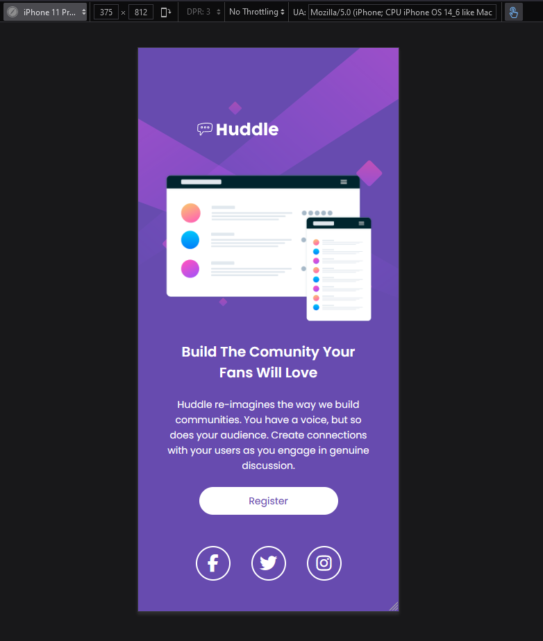

# Challenge - Frontend Mentor = Huddle landing page with a single introductory section

Um projeto para testar o conhecimento de HTML e, principalmente, CSS. Permitindo que seja responsivo, ou seja, funcione tanto para o desktop quanto para mobile.

Acesse o projeto criado aqui: [NFT preview card component](https://cezarviana.github.io/challenge-frontend-mentor-nft-preview-card-component/).

## Descrição da tarefa

- Criar um layout responsivo seguindo os padrões do desafio frontend mentor: [Frontend Mentor | Huddle landing page with a single introductory section](https://www.frontendmentor.io/challenges/huddle-landing-page-with-a-single-introductory-section-B_2Wvxgi0). Onde o principal desafio é construir uma página que permita a visualização de uma landing page de uma rede social "Huddle".

- Criar hovers para os elementos interativos.

### Font family para ser usada no projeto:

- Family: [Poppins - Google Fonts](https://fonts.google.com/specimen/Poppins)
- Weight: 600, 400

### Cores
***
--bg-color: hsl(257, 40%, 49%);  
--active-states: hsl(300, 69%, 71%);  
--font-color: #fff;  
***

### Imagens do Design a ser seguido

  

  

## Imagens do Design criado

  

  

## Tecnologias utilizadas
- HTML
- CSS
- Git Bash

### Como utilizar

1 - Clone o projeto
***
git clone <https://github.com/cezarviana/challenge-frontend-mentor-huddle-landing-page-with-a-single-introductory-section.git>
***

## O que eu aprendi?

Aprendi a fazer sobreposição de imagem no background, como uma marca d'água. Além de adicionar uma imagem de sobreposição pelo CSS.

Abaixo parte do código, do aprendizado.

***
body{
    content:'';
    background: url(../images/bg-desktop.svg) no-repeat center;
    background-size: cover;

    background-color: var(--bg-color);
    display:flex;
    flex-direction: column;
    color: var(--font-color);
    font-family: 'Poppins', sans-serif;
    display: flex;
}
***